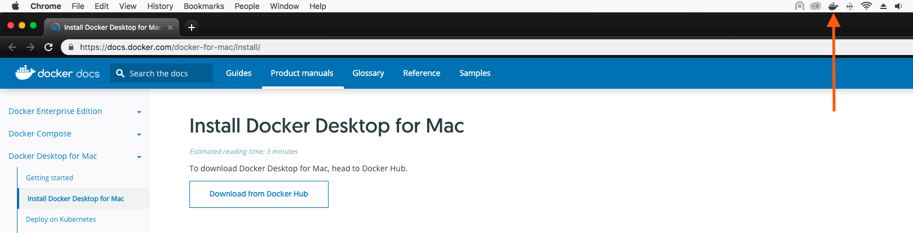
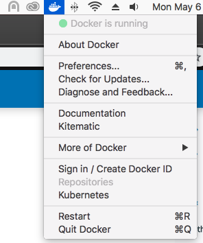
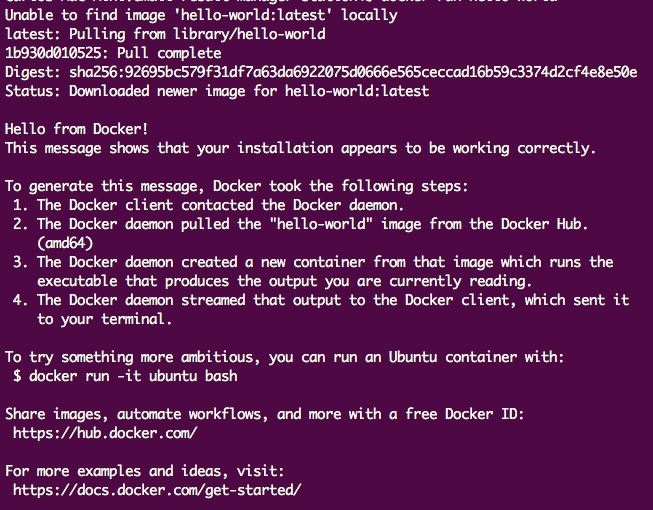
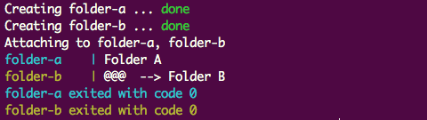
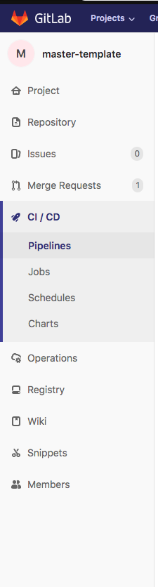
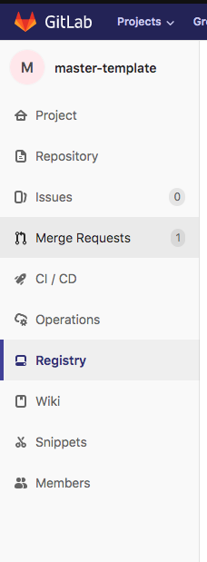
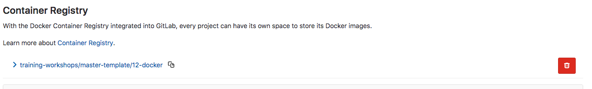

## Docker workshop

### Instrucciones

1. Cree un branch nuevo con el nombre `12-docker-<su_nombre>`.

2. Cambiese al branch creado en el punto anterior

En este workshop veremos:
* Que es docker?
* Diferencias entre una virtual machine y docker
* Instalacion
* Docker CLI
* Docker Compose
* Docker compose CLI

## Que es docker?
**Docker** es una herramienta open source que encapsula nuestra aplicación, es decir toma todos los paquetes y dependencias necesarias para nuestra app y las encapsula en un **container**, de esta manera podremos correrla en cualquier entorno.

Con **docker** no hay necesidad de preocuparse por el sistema operativo de la máquina en la que este corriendo. Imagina que haces una app y quieres compartirla con alguien más, pero al momento de que esa persona va a correrla en su computador falla en algún punto, ya sea por que la versión del lenguaje de programación es distinto, las versiones de los módulos globales sean diferentes, la versión de la base de datos no es compatible o no este instalada, etc. Con docker se puede correr la aplicación de la misma manera en cualquier entorno, lo que la hace escalable y portable.

Un **container**  es una instancia que corre una **imagen** la cual es un archivo que está compuesto por **paquetes**, **dependencias**, **bibliotecas**, y el código ejecutable para nuestra aplicación.

- **Paquetes:** Son los módulos que usa nuestra aplicación (package.json, requirements.txt)
- **Dependencias:** Es lo que necesita nuestra app para poder correr correctamente ya sea una versión especifica de un lenguaje de programación o  una base de datos.
- **Bibliotecas:** son las bibliotecas estándares que posee el sistema operativo de linux que está corriendo dentro del container.

## Diferencias entre una virtual machine y docker

Como sabemos **docker** es una herramienta basada en **containers** los cuales se ejecutan desde una **imagen** que proporciona todos los archivos necesarios para el proceso, donde cada **container** esta aislado de los demás y comparten el núcleo del sistema operativo (host), esto quiere decir que cada **container** va a usar el **kernel** de la máquina en donde se está corriendo.

- **kernel:** Es el núcleo del sistema operativo que se encarga de manejar las tareas y los recursos del sistema, CPU, memoria, etc.

Por otro lado una **máquina virtual** no usa tecnología de **containers**, sino que virtualiza completamente un sistema operativo con sus aplicaciones para correr un proceso, por lo cual cada proceso necesita un sistema operativo completo.

Ambos proporcionan entornos aislados, pero con **docker** se facilita el desarrollo haciéndolo más ligero y rápido, imagina que tienes una app con el mismo código, pero tienes dos archivos que ejecutan diferentes funcionalidades, al crear un container para cada funcionalidad, estos van a reutilizar la misma **imagen**, en cambio con una **máquina virtual**, tendrias que crear una para cada funcionalidad, consumiendo espacio extra. Hay que tener en cuenta que **docker** no hace una virtualización en si, por lo cual no puedes usar un sistema operativo como windows dentro de un container de docker.

## Instalacion
Primero debemos instalar **docker** desde [Aqui](https://docs.docker.com/docker-for-mac/install/), verifique si en su computador ya se encuentra instalado, para hacerlo basta con utilizar el comando `docker --version` desde la consola. Una vez instalado debemos iniciarlo, solamente hay que buscar la aplicación de **docker** y abrirla, luego deberá aparecernos este icono en la parte superior:



Hay que esperar hasta que **docker** termine de iniciar, deberá de aparecer en estado `Docker is running`:



Ahora vamos hacer una prueba para verificar que se instaló de manera correcta, vamos a correr el comando `docker run` el cual va a crear una imagen y un container, cuando **docker** hace esto él intenta buscar la imagen localmente, sino la encuentra intentara buscarla en el **docker hub**.

- **docker hub:** Es el repositorio de imágenes oficial de docker, aquí podras encontrar  diferentes versiones de imágenes como node, python, mysql, etc.

Vamos a correr el siguiente comando:

```
docker run hello-world
```
Como vemos al no tener una imagen llamada **hello-world** localmente, **docker** fue al repositorio para buscarla, la descargó, creó el container y lo ejecutó.

Tendremos que ver un log indicándonos que **docker** fue instalado de manera correcta:



- **docker engine/daemon:** Es el que se comunica con el **kernel** para que el sistema pueda crear, operar y manejar los **containers e imágenes**.

## Docker CLI
**Docker** posee varios comandos que nos permite manejar los **containers e imágenes**, vamos a listar los más usados:

- `docker ps`: Nos muestra la lista de los **containers** que están activos
- `docker create`: Crea un nuevo **container**
- `docker start`: Ejecuta uno o más **containers** que esten ya creados
- `docker run`: Crea un nuevo **container** y lo ejecuta, este viene siendo un atajo entre **docker create** y **docker start**
- `docker restart`: Reinicia uno o más **containers**, hacer esto es necesario cuando hacemos cambios directamente dentro del **container**.
- `docker stop`: Detiene uno o más containers que están corriendo.
- `docker kill`: Este funciona de la misma manera que `docker stop` la diferencia esta en la señal que manda cada uno al container para que termine su proceso. `docker stop` manda una señal de tipo **SIGTERM** y luego de un periodo envia una señal de tipo **SIGKILL**, mientras que `docker kill` envia por defecto una señal de tipo **SIGKILL** pero se le puede indicar la señal que se quiera mandar con el flag `--signal`. [Para mas informacion acerca de las señales de terminacion](https://www.gnu.org/software/libc/manual/html_node/Termination-Signals.html)
- `docker build`: Construye una  **imagen** a partir de un **dockerfile**, del cual hablaremos más adelante
- `docker images`: Muestra la lista de **imágenes** local disponibles
- `docker rm`: Elimina uno o más **containers**
- `docker rmi`: Elimina una o más **imágenes**

Para poder ver las opciones adicionales que posee cada comando se utiliza --help al final de cada uno:

```
docker create --help
```
[Aqui encontraras la lista de todos los comandos que posee docker CLI](https://docs.docker.com/engine/reference/commandline/docker/)

## Docker Compose
**Docker compose** es una herramienta de **docker** que nos permite correr multiples **containers** con un solo comando, se usa un file con extensión `yaml` o `yml`, en el cual se define los servicios que se quieran correr, para cada servicio se creará un **container**, vamos a ver un ejemplo usando **docker compose**.

**Nota:** No hay necesidad de instalar **docker-compose**, ya que viene por defecto al instalar **docker** en osx.

Ubíquese en la carpeta `dockerComposeExample`, observe la estructura de esta carpeta:

- folderA
  - index.js
  - dockerfile
- folderB
  - index.js
  - dockerfile
- folderC
  - app.js
  - dockerfile
  - package.json


Para este primer ejercicio vamos a utilizar unicamente `folderA` y `folderB`.

Vamos a crear un container para cada carpeta utilizando **docker compose**, primero crearemos un file con el nombre de `docker-compose.yml` en la raíz de la carpeta.

Ejemplo de un `docker-compose.yml`:

```yaml
version: "3"
services:
  folder-a:
    build:
      context: folderA/
      dockerfile: dockerfile
    container_name: folder-a
  mongo:
    image: mongo:3.4
    container_name: mongodb
    ports:
      - "27017:27017"
```
**version:** es la versión de **docker-compose** que vamos a utilizar, esta versión nos indica a partir de que versión del **docker engine** es compatible con nuestro `docker-compose.yml`.

Es recomendable usar la ultima version de **docker-compose** pero hay que tener en cuenta que depende de que version del **docker engine** se encuentre instalada en nuestro computador, para verificar la version  de nuestro **docker engine** se utiliza el siguiente comando: ``` docker version```

[para más información acerca de las versiones de docker compose](https://docs.docker.com/compose/compose-file/).

**Nota:** En los ejemplos que vamos a ver acerca de **docker-compose** vamos a utilizar la version 3 ya que es la mas compatible con la mayoria de versiones del **docker engine**

**services:** Aquí se indican los servicios que vamos a levantar cuando corramos el **docker compose**, dentro de **services** se define el nombre del servicio (el que queramos poner):
  - **image:** Aqui se indica la imagen que se va a utilizar desde el [docker hub](https://hub.docker.com/)
  - **build:** Cuando queremos construir una imagen personalizada a partir de un **dockerfile** se utiliza el **build**, el cual recibe dos opciones, el **context** que hace referencia a la ruta que contiene el código que queremos que se encapsule en nuestro **container**, y el **dockerfile** que es la ruta de nuestro **dockerfile** partiendo del **context**.
  - **container_name:** Especifica un nombre personalizado para nuestro **container**, hay que tener en cuenta que los nombres de los **containers** deben ser unicos.

Vamos a implementar lo siguiente en el `yml` que acabamos de crear:

```yaml
version: "3"
services:
  folder-a:
    build:
      context: folderA/
      dockerfile: dockerfile
    container_name: folder-a
  folder-b:
    build:
      context: folderB/
      dockerfile: dockerfile
    container_name: folder-b
```

### DockerFile
```yaml
FROM node:8.16.0-jessie

COPY . /srv/www/exampleFolder
WORKDIR /srv/www/exampleFolder

RUN npm i --silent

CMD node index.js

```
Un **dockerfile** es un documento que contiene los comandos necesarios para poder construir una **imagen**.

**FROM:** todo **dockerfile** debe comenzar con la sentencia **FROM** indicando una imagen que esté disponible en el **docker hub**, esto depende de lo que necesites para correr el proyecto, por ejemplo, si necesitas instalar los packages de tu proyecto (`npm i`) necesitarás una imagen de **node**. Puedes hacer uso de **FROM** más de una vez, separado por salto de línea:
```
FROM python:3.6.8-jessie
FROM node:8.16.0-jessie
```
[ aquí encontraras las imágenes disponibles en el repositorio de docker](https://hub.docker.com/)

**COPY:** Indica la ruta que se va a copiar dentro del **container**, el primer parámetro es la ruta de los archivos locales y el segundo es la ruta dentro del **container** donde van a quedar nuestros archivos.

**Nota:** Si vemos el **COPY** en el ejemplo anterior veremos que al primer parametro le estamos pasando un `.` esto indica que se quiere copiar todos los archivos que esten al mismo nivel del **dockerfile**

**WORKDIR:** Indica el path desde donde se van a ejecutar los comandos que definamos en el **CMD**.

**RUN:** Este comando va a correr lo que le indiquemos mientras se construye la imagen, por lo general aquí indicamos que se instalen los **paquetes** u otras **dependencias** necesarias para nuestra app.

**Nota:** No hay necesidad de usar `nvm use` cuando se este usando node, ya que nosotros en el **FROM** le estamos indicando que versión de **node** se va a utilizar.

**CMD:** Permite indicar el comando por defecto que va a tener nuestro **container** al momento de ejecutarlo, aquí  se debe indicar el comando que necesitemos para poder iniciar nuestra aplicación.


Ahora vamos a levantar nuestros dos servicios de una manera sencilla:

```
docker-compose up
```

Deberia aparecer un log como este:



Como vemos **docker compose** nos creó dos **containers** con sus respectivas imágenes utilizando un solo comando, estas imágenes fueron creadas a partir de los **dockerfiles** que se encuentran en `folderA` y `folderB`.

### Ejercicio
Ahora vamos a crear el service para el `folderC` en el `docker-compose.yml`, luego vuelve correr el comando de `docker-compose up -d` para levantar los servicios, deberás de ver los resultados de `folderC` si ingresas a `http://localhost:3000/`.

**Nota:** la opcion `-d` en el comando `docker-compose up` permite que se levanten los **containers** sin necesidad de que queden corriendo en nuestra consola.

En este punto verás que no puedes ingresar a `http://localhost:3000/` esto se debe a que no está expuesto el puerto `3000` del container de `folderC` a nuestro computador (**host**), es decir dentro del container está corriendo `http://localhost:3000/`, pero para poder acceder a esto es necesario exponer este puerto al host, para hacer esto hay que agregar la opción de **ports** a nivel de **build** en nuestro **service** de **folderC**:

```yaml
ports:
  - "3000:3000"  #puerto_del_HOST:puerto_del_container
```

`Nota:` No es necesario que el puerto del host sea igual al que usa el **container**, pero por buenas prácticas se expone el mismo puerto que está usando el **container**.

Luego vuelve a correr `docker-compose up -d` e ingresa a `http://localhost:3000/` para verificar que funciona correctamente el **container** de `folderC`.

### Volumes
La información en los **containers** de docker no persiste, si este **container** es eliminado toda esa información desaparecerá, por esto es recomendable usar **volumes** cuando queremos persistir información que se genera dentro de los **container**.

Vamos a ver un ejemplo del uso de los **volumes**, primero ingresamos a la carpeta `dockerComposeVolumes` y levantamos el servicio **wait-service** usando `docker-compose up -d`.

Ahora vamos a copiar el file `copy-into-container.txt` dentro del container, para esto vamos a usar el siguiente comando:

```
- docker cp <file_or_folder> <container_name>:<workdir>
```

Este comando lo que hace es copiar un archivo o una carpeta local dentro del **container** y viceversa.

Usa el siguiente comando para pegar el file `copy-into-container.txt`:

```
docker cp copy-in-container.txt wait-service:/srv/www/wait/
```

Si queremos validar que nuestros cambios se encuentran en el **container**, existe un comando para poder ingresar directamente a la consola del **container**, este comando solo funciona si el **container** esta corriendo:

```
- docker exec -ti <container_name> bash
```

Luego de que estemos dentro del container podemos usar `ls` para listar los archivos que se encuentran dentro. Para poder ver el contenido de los archivos podemos usar el comando `cat <nombre_del_archivo>` y para salir de la consola del container se usa el comando `exit`.

Ahora que ya hemos validado que nuestro archivo `copy-into-container.txt` se encuentra dentro del container, vamos a detener el **container** y eliminarlo de la siguiente manera:

```
- docker stop wait-service
- docker rm wait-service
```

Luego vamos a levantar de nuevo el **container** (`docker-compose up -d`) y verificar el archivo que acabamos de copiar, vamos a ver que no se va a encontrar dentro de nuestro container, ya que al remover el container toda la información que poseía desapareció. Ahora vamos a crear un **volumen** para persistir nuestra información, implementa lo siguiente en el `docker-compose.yml`:

```yaml
version: "3"
services:
  wait:
    build:
      context: ./waitService/
      dockerfile: dockerfile
    container_name: wait-service
    volumes:
      - waitvolumen:/srv/www/wait/
volumes:
  waitvolumen:
```
Vemos que agregamos una nueva opción llamada **volumes**, que se encuentra a nivel de **services** la cual indica el nombre del **volumen** que va a crear **docker**, y otra a nivel del servicio de **wait**, donde primero indica en que **volumen** va almacenar la información y luego desde que directorio dentro del **container** va a tomar esa información. En pocas palabras esto crea un backup en nuestro host.

Volvemos a levantar nuestro container con `docker-compose up -d`  y vamos a validar que nuestro **volumen** fue creado, deberá de aparecer un **volumen** con el nombre **dockercomposevolumes_waitvolumen**. Con el siguiente comando podrás ver la lista de **volumenes**:

```
docker volume ls
```

Vamos hacer el mismo proceso de copiar el archivo txt dentro del container, eliminar el container y volverlo a levantar, pero esta vez deberiamos de ver que la informacion dentro de él persiste.

## Docker compose CLI
**Docker compose** también posee su CLI, para manejar los containers que definamos en el `yml`, vamos a ver los más usados:

- `docker-compose up`: Levanta y corre todos los servicios que estén definidos en el `yml`.
- `docker-compose ps`: Muestra la lista del estado de los container que estén en el `yml`.
- `docker-compose restart`: Reinicia los containers que están definidos en el `yml`
- `docker-compose stop`: detiene los containers que están definidos en el `yml`

Como vemos son parecidos a los del **docker CLI**. [Aqui puedes encontrar la lista con los comandos que están disponibles](https://docs.docker.com/compose/reference/overview/)

**Nota:** al igual que en **docker**, si se agrega el flag `--help` a cada comando, podremos ver las opciones de cada uno.

## Ejercicio propuesto
Primero debemos de parar todos los containers que esten corriendo en este momento (`docker stop <container_name>`), luego ubíquese en la carpeta `dockerComposeExercise` y cree un archivo `docker-compose.yml`, en donde va a definir tres servicios, uno para **web**, uno para **backend** y uno para **mongo**, se espera que los tres **containers** esten corriendo y que desde `http://localhost:1025/` (**web**) se realice el request a `http://localhost:8000/` (**backend**) y este almacene la info en la DB, la cual puedes validar en mongo.

**Nota:** Ten en cuenta que tienes que exponer los puertos en cada uno de los **containers** para que puedan ser usados. Tambien debes instalar las dependencias (`npm i`) desde el **dockerfile** con el comando **RUN**.

En este punto luego de levantar los **containers** observaras que el request al backend no está funcionando, veremos un error en el container de **web**:

```
http://localhost:1025/api/ 504 (Gateway Timeout)
```

Esto se debe a que se está accediendo al `localhost:8000` desde el **container**, es decir el **container** de **web** está redireccionando a  `localhost:8000` de su propio container, el cual no está corriendo ningún proceso en ese puerto. Lo que pasa es que el **backend** lo estamos corriendo en un **container** diferente, recuerda que cada **container** está aislado de los demás **containers** por lo que es necesario indicarle al **container** de **web** que acceda al host del **container** del **backend**. Modifica el **target** en la seccion del **proxy** del **devServer** en el webpack de **web**:

```javascript
proxy: {
      "/api": {
        "target": 'http://<nombre_del_container_del_backend>:8000/',
        "pathRewrite": { '^/api': '' },
        "changeOrigin": true,
        "secure": false
      }
    }
```
Esto tambien es necesario para realizar la conexión a mongo desde el **container** del **backend** ya que ocurre lo mismo, modifica el file `backend/app.js` con `<name_container_mongo>:27017`.

**Nota:** El nombre del container de mongo debe estar en lower case, por que esto afecta a la conexion con mongoose.

para poder ver que pasa internamente en los logs de los **containers** se puede usar el siguiente comando:

```
docker logs <nombre_del_container>
```

Para actualizar estos cambios de los nombres de los **containers** y cualquier otro cambio que se haga en el código es necesario reconstruir la imagen, esto se puede hacer con los siguientes comandos:
```
- docker-compose build
- docker-compose up --build
- Se puede indicar que solamente se reconstruya la imagen de un servicio:
  - docker-compose build <nombre_del_servicio>
  - docker-compose up <nombre_del_servicio> --build
```
La opcion `--build` y el comando `build` nos permite reconstruir las imagenes de los servicios de nuestro `yml`, por lo cual se volverá a correr lo que esté definido en el **dockerfile** para construir la imagen, es decir volverá a instalar las dependencias y packages.

**Nota:** Cuando queremos actualizar la configuracion de nuestros containers desde el archivo `docker-compose.yml`, como por ejemplo los puertos o el nombre de un container, se utiliza `docker-compose up -d` pero hay que tener en cuenta que esto no va a recrear las imagenes con los nuevos cambios que hagamos en el codigo, para eso es necesario agregarle la opcion `--build`.


Hay una manera mas rapida para actualizar los cambios en el **container** y es con el comando `docker cp` el cual nos permite copiar un archivo o carpeta local al **container**, de esta manera no es necesario volver a reconstruir la imagen para ver los cambios, pero es necesario reiniciar el **container** con `docker restart <nombre_del_container>`. Este comando es muy util cuando hacemos cambios en el codigo y queremos probar rapidamente sin necesidad de hacer un rebuild de las imagenes, pero cuando hayamos instalado un nuevo modulo en nuestro proyecto, es necesario volver a construir la imagen, ya que copiar la carpeta de `node_modules` al **container** no es recomendado.

Luego de que hayas actualizado los containers con los cambios, verifica que el request hacia el **backend** se este realizando satisfactoriamente.

## Crear una imagen de docker en el registry de Gitlab
Primero debemos crear una imagen de nuestro branch en el repositorio. **Gitlab** nos ofrece una opción llamada **container registry** la cual nos permite almacenar en nuestro **Gitlab** imágenes de **docker**.

Debemos hacer login para autentificar al usuario que va crear esa imagen en el repositorio, esto es lo que debe recibir el **registry** incluyendo el usuario y la contraseña:

```
docker login <registry_del_repositorio> -u<user> -p<password>
```

`Registry:` Cada repositorio posee su **registry** el cual es el sistema de almacenamiento y distribución para las imágenes de **docker**, esto permite que usuarios puedan extraer localmente imágenes desde el **registry** como también enviar nuevas imágenes.

Luego de que hacemos login en el **registry** del repositorio, debemos construir la imagen a partir de un `dockerfile` de la siguiente manera:

```
- docker build -t <nombre_de_la_imagen> -f <Path_del_dockerfile> <contexto>
```

Ejemplo:
```
- docker build -t folderAImage -f dockerComposeExample/folderA/dockerfile folderA/
```

Luego debemos hacer push de la imagen al **registry**:

```
docker push `nombre_de_la_image`
```

Este proceso no se hace localmente en tu computador, sino que se hace con el **Gitlab runner**, el cual es una instancia de compilación que se utiliza para ejecutar diferentes procesos en *Gitlab* llamados **jobs**. Imagina que haces una nueva implementación en el código de un proyecto y creas un branch (`new/update`), la idea es que cuando acepten el **Merge request** de tu branch en **development** el **Gitlab runner** cree la imagen de `development` con el nuevo código en el **registry**, lo mismo pasaría cuando se realice merge request de **development** a **master**.

Para definir estos pasos se debe crear en la raíz del proyecto un archivo llamado `.gitlab-ci.yml`, este le indica al **Gitlab runner** que es lo que debe hacer.

`.gitlab-ci.yml`

```yaml
services:
  - docker:dind
  - mongo:3.6

stages:
  - build

buildBackend:
  stage: build
  image: docker:latest
  before_script:
    - apk add git bash nodejs nodejs-npm --no-cache
    - (cd web2 && npm install)
  script:
    - ./buildBackendImage
  only:
    - develop
```
 - `services:` Usa imágenes de los servicios de docker que necesitemos para nuestros **jobs** en general.
 - `stages:` Define el orden en el que se deben ejecutar los **jobs**.
 - `image:` indica la imagen de docker con la que se va a crear el container que va a usar nuestro **job**.
 - `before_script:` Son los comandos que se van a ejecutar antes de que se corra el script en el *job*
 - `script:` el script que se va a ejecutar por la consola del **runner**.
 - `only:` Este indica en qué branches se va a correr nuestro job en el **runner**.


El file que ve en la sección de **script** en nuestro `.gitlab-ci.yml` es el que va a realizar el proceso de creación de la imagen en el **registry** como vimos anteriormente:


```bash
#!/bin/bash
REPO=registry.gitlab.com
IMAGE_NAME=$REPO/training-workshops/master-template
TAG=${CI_COMMIT_REF_NAME//\//-}
IMAGE_BUILD_NAME=$IMAGE_NAME/$TAG-scheduler:$CI_PIPELINE_ID
IMAGE_BUILD_NAME=${IMAGE_BUILD_NAME,,} #convert to lowercase
docker login $REPO -u$DOCKER_REGISTRY_USER -p$DOCKER_REGISTRY_PASS
docker build -t $IMAGE_BUILD_NAME -f backend/dockerfiles/scheduler/Dockerfile backend/
docker push $IMAGE_BUILD_NAME

```

Vamos a crear una imagen en el registry de **master-template** para esto vamos a crear en el root del proyecto `master-tempalte` el archivo de `.gitlab-ci.yml` e ingresaremos lo siguiente:

```yaml
services:
  - docker:dind

stages:
  - build

buildFolderA:
  stage: build
  image: docker:latest
  script:
    - ./dockerGitlabCI/buildImage
  only:
    - 12-docker
```

Ahora vamos a crear el script para construir la imagen en el **registry**, vamos a crear una carpeta llamada **dockerGitlabCI** y crearemos un file llamado **buildImage** con lo siguiente :

```bash
#!/bin/bash

REPO=gitlab.vovsolutions.com:4567
IMAGE_NAME=$REPO/training-workshops/master-template
TAG=${CI_COMMIT_REF_NAME//\//-}
IMAGE_BUILD_NAME=$IMAGE_NAME/$TAG:$CI_PIPELINE_ID
IMAGE_BUILD_NAME=${IMAGE_BUILD_NAME,,} #convert to lowercase
docker login $REPO -u gitlab-ci-token -p$CI_JOB_TOKEN
docker build -t $IMAGE_BUILD_NAME -f ./dockerComposeExample/folderC/dockerfile ./dockerComposeExample/folderC
docker push $IMAGE_BUILD_NAME
```
Es necesario darle permisos a nuestro file para que el **runner** pueda ejecutarlo:

```
chmod +x buildImage
```

Una vez finalizado este Workshop

* Utilice el comando git status para verificar que archivos han cambiado
* Utilice el comando git add para agregar estos cambios
* Utilice el comando git commit -m con el siguiente mensaje: Workshop docker - Actualización de docker
* Utilice el comando git push para enviar sus cambios y verifique en gitlab que estos están presentes

Para ver el proceso del **gitlab runner** debemos de ingresar en la sección **CI/CD** de nuestro repositorio e ingresar a **pipelines**:



Ahora verifica que la imagen de docker que le indicamos al **gitlab runner** se haya creado, para eso debemos ingresar al **registry** de nuestro repositorio:





Si vemos el detalle de nuestra imagen podremos ver los diferentes **tags** que posee los cuales hace referencia de cual commit se construyó, ahora vamos a crear un **container** local con la imagen que acabamos de crear, para eso debemos de loguearnos con nuestro usuario y contraseña de Gitlab:

```
- docker login gitlab.vovsolutions.com:4567 -u<user> -p<password>
- docker run -p 3001:3000  --name folderC-registry -d <tag>
```
**Nota:** recuerda que el `<tag>` es el que tengas en tu registry, al lado aparecerá un icono para copiar el **tag** completo.

Links de ayuda:
- https://docs.docker.com/get-started/
- https://docs.docker.com/docker-for-mac/install/
- https://docs.docker.com/engine/reference/commandline/docker/
- https://docs.docker.com/compose/
- https://docs.docker.com/compose/reference/overview/
- https://docs.docker.com/engine/reference/builder/
- https://docs.docker.com/compose/compose-file/
- https://docs.gitlab.com/ee/ci/quick_start/